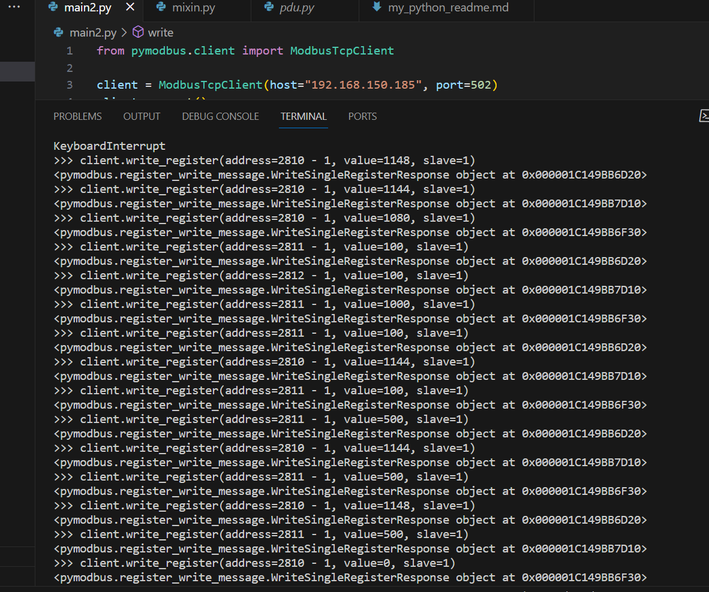

##Temperature Controlled with DC Fan using stm32 NUCLEO_F446RE.
This project  the idea of controlling the fan based on the variation of temperature. Through this project we intended:

1. To build a system to detect temperature of the room and execute the contrast of the current temperature.
2. Making a system that does not allow the room temperature to rise above a certain limit.
3. To erect a time-saving and use worthy set-up.
4. Assembling this structure to reduce the usage of electricity, minimizing power wastage and save money.

Temperature controlling is required in many places such as server rooms, houses, industries, etc. So, stm32 microcontroller based temperature controlled DC fan project is very useful, which can be used anywhere. This project works in three parts: At first, the sensor senses the temperature by temperature and humidity sensor namely BMP180. Secondly, the sensor's output is taken and conversion of temperature value into a suitable number in Celsius scale is done. The fan controlled by using PWM signals. And last part of the system shows temperature on LCD and Fan ON and off.

## Components used :

    ~ STM32F446RE Microcontroller
    ~ BMP180 module - pressure and temperature sensor
    ~ 5V DC Fan
    ~ I2C Serial Interface 1602 (16x2 LCD display module)

##datasheet

BMP180 module datasheet: 
 [link](https://cdn-shop.adafruit.com/datasheets/BST-BMP180-DS000-09.pdf).

  ## Installation
 To install the project, follow these steps:

1. Clone the repository
2. Open the project in your preferred IDE
3. Compile and upload the code to the NUCLEO_F446RE microcontroller
    