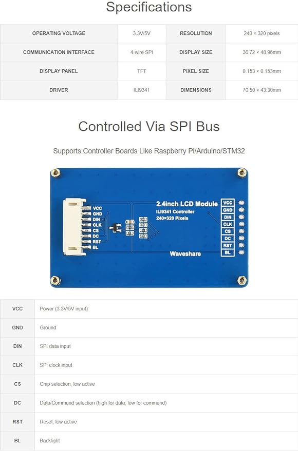

# Notes

## note01: Using a function from another file 

### method-1 (without using header files)

Example:

    ## main.c

    void get_speed() {
        ...
    }

    ## speed.c

    extern void get_speed();

    int test {

        get_speed();
    }

### method-2 (with using header files)

Example:

    ## main.c

    void get_speed() {
        ...
    }

    ## main.h

    void get_speed();

    ## speed.c

    #include "main.h"

    int test {

        get_speed();
    }    

## note02: different methods of using a function

Examples:

### Example1 (ERROR)

    ## main.c #######################

    int main() {
        get_speed();
    }

    int get_speed() {  // must be before main()
        ...
    }

### Example2 (ok)

    ## main.c #######################

    int get_speed() {  // must be before main()
        ...
    }

    int main() {
        get_speed();
    }

### Example3 (ok)

    ## main.c #######################

    int get_speed();

    int main() {
        get_speed();
    }   

    int get_speed() {  // must be before main()
        ...
    } 

### Example4 (ok)

    ## main.c #######################

    #include "main.h"

    int main() {
        get_speed();
    }   

    int get_speed() {  // must be before main()
        ...
    } 

    ## main.h ######################

    int get_speed();

# test

Hi Farya, this is the [link](www.google.com).

even to a [file](../Src/main.c)

this is my.

